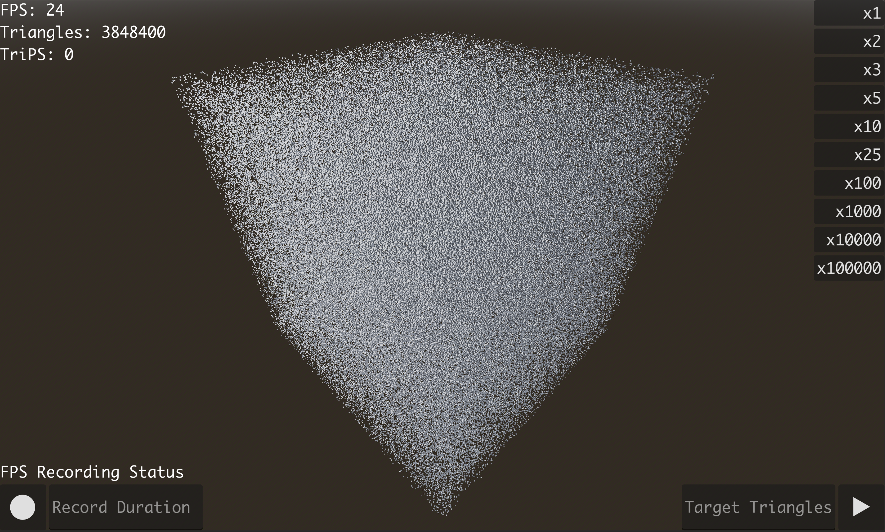

# Triangle-Simulation

This is a very simple and lightweight triangle simulation I created for a science assesment. It checks to see how many triangles your computer can simulate. The default mesh instance is a cube but you can change it by fiddling around in the godot project. But keep in mind that the triangle counter only works for cubes, and spheres.

